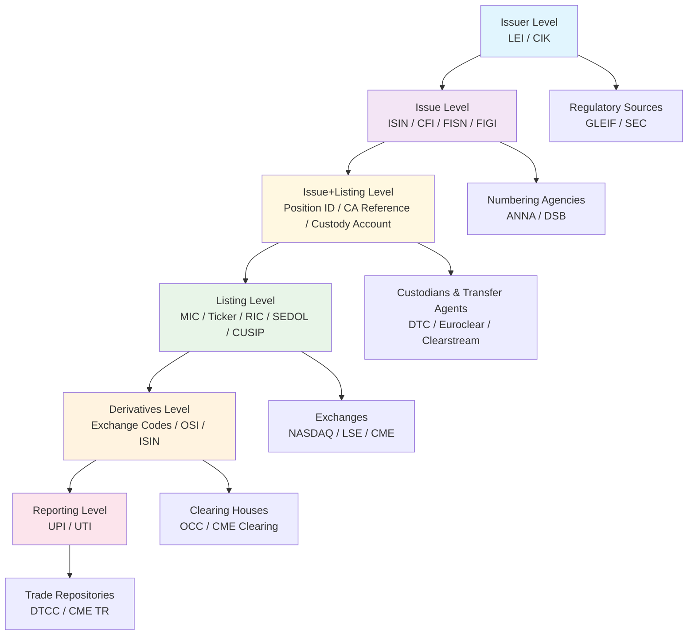

# Trading Instrument Reference Data: A Practitioner's Guide

*For Front-Office, Risk, and Post-Trade Engineers*

## 1. Taxonomy & Scope

### Listed vs. Derivative Instruments

**Listed/Vanilla Securities** represent direct ownership or debt obligations:
- **Equities**: Common/preferred shares, ADRs/GDRs, ETFs, REITs
- **Fixed Income**: Government bonds, corporate bonds, municipal bonds, money market instruments
- **Funds**: Mutual funds, closed-end funds, unit trusts

**Derivatives** derive value from underlying instruments:
- **Exchange-Traded Derivatives (ETD)**: Futures, options, listed swaps
- **Over-the-Counter (OTC)**: Interest rate swaps, credit default swaps, FX forwards, structured products

### Pricing vs. Trading Datasets

**Pricing Securities** focus on valuation and fair value measurement:
- Evaluated prices, yield curves, volatility surfaces
- IFRS 13 / ASC 820 fair value hierarchy classification [Source: IFRS Foundation, 2023]
- Pricing vendor identifiers and methodologies
- Close prices vs. executable quotes

**Trading Securities** emphasize execution and operational requirements:
- Venue-specific symbology and routing information
- Trading rules (tick sizes, lot sizes, trading calendars)
- Clearing and settlement identifiers
- Regulatory flags and compliance requirements

## 2. Core Reference Fields (by Asset Class)

### Equity Instruments
- **Issuer**: LEI, CIK, company name, domicile
- **Instrument**: ISIN, CFI, FISN, FIGI, share class
- **Listing**: Exchange MIC, ticker, RIC, SEDOL, CUSIP
- **Trading**: Tick size, lot size, currency, trading calendar
- **Settlement**: Settlement cycle, clearing house, DTC participant

### Fixed Income Instruments
- **Issuer**: LEI, CIK, issuer type (sovereign/corporate)
- **Instrument**: ISIN, CFI, FISN, FIGI, issue size, currency
- **Terms**: Face value, coupon rate, maturity date, day count convention
- **Trading**: Minimum increment, par value, trading calendar
- **Settlement**: Settlement cycle, clearing house, custodian
- **Swiss Market**: Valoren number for Swiss franc denominated bonds and foreign bonds traded in Switzerland

### Exchange-Traded Derivatives
- **Product**: Exchange product code, contract specifications
- **Instrument**: ISIN (where assigned), OCC/OSI (options), contract month
- **Trading**: Tick size, contract size, trading hours, last trading day
- **Clearing**: Clearing house, margin requirements, settlement method

### OTC Derivatives
- **Product**: UPI, product taxonomy, underlying reference
- **Trade**: UTI, trade date, maturity, notional, currency
- **Counterparties**: LEI, credit support annex terms
- **Reporting**: EMIR/UK EMIR fields, trade repository identifiers

## 3. Identifier Hierarchy & Governance

### Issuer-Level Identifiers
**LEI (Legal Entity Identifier)** [Source: GLEIF, ISO 17442]
- **Governing Body**: GLEIF (Global Legal Entity Identifier Foundation)
- **Scope**: Global legal entity identification
- **Structure**: 20-character alphanumeric (4-4-4-4-4)
- **Example**: 529900W1K3P5Q9R0T2U3
- **Change Frequency**: Low (entity structure changes)
- **Level 2**: Parent-child relationships for corporate hierarchies

**SEC CIK (Central Index Key)**
- **Governing Body**: US Securities and Exchange Commission
- **Scope**: US public company filers
- **Structure**: 10-digit numeric
- **Example**: 0000320193 (Apple Inc.)
- **Change Frequency**: Very low (company registration changes)

### Issue-Level Identifiers (Global)
**ISIN (International Securities Identification Number)** [Source: ANNA, ISO 6166]
- **Governing Body**: ANNA (Association of National Numbering Agencies)
- **Scope**: Global security identification
- **Structure**: 12-character alphanumeric (2-9-1)
- **Example**: US0378331005 (Apple Inc. Common Stock)
- **Change Frequency**: Low (corporate actions, reissuance)

**CFI (Classification of Financial Instruments)** [Source: ANNA, ISO 10962]
- **Governing Body**: ANNA/DSB (Derivatives Service Bureau)
- **Scope**: Financial instrument classification
- **Structure**: 6-character alphabetic
- **Example**: ESVUFR (Equity, Common Share, Voting, Unrestricted, Registered)
- **Change Frequency**: Very low (instrument type changes)

**FISN (Financial Instrument Short Name)** [Source: ISO 18774]
- **Governing Body**: ANNA
- **Scope**: Human-readable instrument names
- **Structure**: Up to 35 characters
- **Example**: APPLE INC
- **Change Frequency**: Low (corporate actions)

**FIGI (Financial Instrument Global Identifier)**
- **Governing Body**: Bloomberg (Open Symbology)
- **Scope**: Global instrument identification
- **Structure**: 12-character alphanumeric
- **Example**: BBG000B9XRY4
- **Change Frequency**: Low (corporate actions)

### Issue+Listing-Level Identifiers (Accounting & Asset Servicing)
**Position Identifiers**
- **Governing Body**: Custodians and asset servicers
- **Scope**: Unique position tracking across corporate actions
- **Structure**: Institution-specific formats
- **Example**: CUST_001_POS_20231215_001
- **Change Frequency**: Per corporate action
- **Purpose**: Track positions through splits, mergers, spin-offs, and other corporate actions

**Corporate Action Reference IDs**
- **Governing Body**: Issuers and transfer agents
- **Scope**: Corporate action event identification
- **Structure**: Event-specific formats
- **Example**: CA_20231215_SPLIT_2FOR1
- **Change Frequency**: Per corporate action event
- **Purpose**: Link positions to specific corporate action events

**Custody Account Identifiers**
- **Governing Body**: Custodians and depositories
- **Scope**: Account-level position aggregation
- **Structure**: Institution-specific formats
- **Example**: DTC_123456789
- **Change Frequency**: Low (account structure changes)
- **Purpose**: Aggregate positions across multiple holdings

### Listing/Venue-Level Identifiers
**Market Identifier Code (MIC)** [Source: SWIFT, ISO 10383]
- **Governing Body**: SWIFT (Society for Worldwide Interbank Financial Telecommunication)
- **Scope**: Trading venue identification
- **Structure**: 4-character alphabetic
- **Example**: XNAS (NASDAQ), XLON (London Stock Exchange)
- **Change Frequency**: Very low (venue changes)

**Ticker Symbols**
- **Governing Body**: Individual exchanges
- **Scope**: Exchange-specific instrument identification
- **Structure**: Variable length alphanumeric
- **Example**: AAPL (NASDAQ), VOD (LSE)
- **Change Frequency**: Medium (corporate actions, symbol changes)

**RIC (Reuters Instrument Code)**
- **Governing Body**: LSEG (London Stock Exchange Group)
- **Scope**: Reuters/Refinitiv platform identification
- **Structure**: Variable format with exchange prefix
- **Example**: AAPL.O (Apple on NASDAQ)
- **Change Frequency**: Medium (corporate actions)

**SEDOL (Stock Exchange Daily Official List)**
- **Governing Body**: LSEG
- **Scope**: UK and Irish securities
- **Structure**: 7-character alphanumeric
- **Example**: 2046251 (Apple Inc.)
- **Change Frequency**: Low (corporate actions)

**CUSIP/CINS (Committee on Uniform Securities Identification Procedures)**
- **Governing Body**: CGS (CUSIP Global Services)
- **Scope**: US and Canadian securities
- **Structure**: 9-character alphanumeric
- **Example**: 037833100 (Apple Inc.)
- **Change Frequency**: Low (corporate actions)

**Valoren (Swiss Security Number)**
- **Governing Body**: SIX Financial Information (Swiss Financial Market Infrastructure)
- **Scope**: Swiss securities and foreign securities traded in Switzerland
- **Structure**: 6-9 digit numeric
- **Example**: 12345678 (Nestlé SA)
- **Change Frequency**: Low (corporate actions)
- **Purpose**: Swiss market identification, settlement, and regulatory reporting

### Derivative Product-Level Identifiers
**Exchange Product Codes**
- **Governing Body**: Individual exchanges
- **Scope**: Exchange-specific derivative products
- **Example**: ES (E-mini S&P 500 futures, CME)
- **Change Frequency**: Low (product changes)

**OCC/OSI (Options Clearing Corporation/Option Symbol Index)**
- **Governing Body**: OCC
- **Scope**: US options symbology
- **Structure**: Variable format
- **Example**: AAPL230616C00150000 (Apple call option)
- **Change Frequency**: Medium (expiry cycles)

**UPI (Unique Product Identifier)** [Source: ANNA-DSB, ISO 4914]
- **Governing Body**: ANNA-DSB
- **Scope**: OTC derivative product identification
- **Structure**: 12-character alphanumeric
- **Example**: 4A2P9F5K8M3N
- **Change Frequency**: Low (product changes)

**UTI (Unique Trade Identifier)** [Source: CPMI-IOSCO, ISO 23897]
- **Governing Body**: Trade repositories and reporting entities
- **Scope**: Individual trade identification
- **Structure**: 52-character alphanumeric
- **Example**: 2023-01-15-TRADE-001-ABC-BANK-XYZ-BANK
- **Change Frequency**: Per trade (unique per transaction)

## 4. Cross-Identifier Symbology Crosswalks

| Layer | Primary ID | Secondary IDs | Governance | Change Drivers | Access |
|-------|------------|---------------|------------|----------------|---------|
| Issuer | LEI | CIK, Company Name | GLEIF, SEC | Corporate structure | Public |
| Issue | ISIN | CFI, FISN, FIGI | ANNA | Corporate actions | Public |
| Issue+Listing | Position ID | CA Reference, Custody Account | Custodians, Transfer Agents | Corporate actions | Private |
| Listing | MIC + Ticker | RIC, SEDOL, CUSIP | Exchange, LSEG, CGS | Symbol changes | Licensed |
| Derivatives | Exchange Code | OSI, UPI | Exchange, OCC, ANNA-DSB | Product changes | Licensed |
| Reporting | UTI | Trade-specific | Trade repositories | Per trade | Regulatory |

### Crosswalk Example: Apple Inc. Common Stock
```
Issuer: 529900W1K3P5Q9R0T2U3 (LEI) → 0000320193 (CIK)
Issue: US0378331005 (ISIN) → ESVUFR (CFI) → APPLE INC (FISN) → BBG000B9XRY4 (FIGI)
Issue+Listing: CUST_001_POS_20231215_001 (Position ID) → CA_20231215_SPLIT_2FOR1 (CA Reference) → DTC_123456789 (Custody Account)
Listing: XNAS:AAPL (MIC:Ticker) → AAPL.O (RIC) → 2046251 (SEDOL) → 037833100 (CUSIP)
Derivatives: AAPL230616C00150000 (OCC/OSI for options)
```

### Crosswalk Example: Nestlé SA (Swiss Market)
```
Issuer: 529900W1K3P5Q9R0T2U3 (LEI) → 0000320193 (CIK)
Issue: CH0038863350 (ISIN) → ESVUFR (CFI) → NESTLE SA (FISN) → BBG000B9XRY4 (FIGI)
Issue+Listing: CUST_002_POS_20231215_001 (Position ID) → CA_20231215_DIV_001 (CA Reference) → SIX_987654321 (Custody Account)
Listing: XSWX:NESN (MIC:Ticker) → NESN.S (RIC) → 12345678 (Valoren) → 003886335 (CUSIP)
Derivatives: NESN231215C00100000 (OCC/OSI for options)
```

## 5. Pricing vs. Trading Data Model

### Pricing Data Model
**Valuation Fields**
- Evaluated price, bid/ask spread, yield, duration
- Pricing methodology, confidence intervals
- IFRS 13 / ASC 820 fair value hierarchy level
- Pricing vendor identifiers and timestamps

**Market Data Integration**
- Real-time feeds, end-of-day prices
- Historical price series, corporate action adjustments
- Currency conversion rates, cross-currency pairs

### Trading Data Model
**Execution Fields**
- Venue MIC, segment MIC, trading status
- Tick size, lot size, minimum increment
- Trading calendar, market hours, holidays
- LULD bands (US), circuit breakers

**Routing and Clearing**
- Clearing house codes, settlement instructions
- Custodian identifiers, DTC participant codes
- Regulatory flags, compliance requirements

## 6. Common Challenges & Control Patterns

### Cross-Listing and DR Collisions
**Challenge**: Same instrument listed on multiple venues with different symbology
**Solution**: Golden source mapping with survivorship rules
- Primary listing determination
- Cross-reference maintenance
- Corporate action synchronization

### Symbol Churn vs. Persistence
**Challenge**: Local identifiers change while global identifiers persist
**Solution**: Multi-level identifier strategy
- LEI/ISIN as persistent anchors
- Local identifier change tracking
- Historical mapping preservation

### Exchange Segment MIC vs. Operating MIC
**Challenge**: Multiple trading segments within single exchange
**Solution**: Hierarchical MIC structure
- Operating MIC (e.g., XNAS)
- Segment MIC (e.g., XNAS-ARCA)
- Clear hierarchy documentation

### Quality Control Patterns
**Completeness**: Required field validation, mandatory identifier presence
**Uniqueness**: Duplicate detection, conflict resolution
**Referential Integrity**: Cross-reference validation, orphan detection
**Lineage**: Source tracking, change audit trails

## 7. Worked Mini-Example

### Large-Cap Equity: Apple Inc. (AAPL)

**Issuer Level**
- LEI: 529900W1K3P5Q9R0T2U3 [Source: GLEIF]
- CIK: 0000320193 [Source: SEC]

**Issue Level**
- ISIN: US0378331005 [Source: ANNA]
- CFI: ESVUFR [Source: ANNA]
- FISN: APPLE INC [Source: ANNA]
- FIGI: BBG000B9XRY4 [Source: Bloomberg]

**Listing Level**
- MIC: XNAS (NASDAQ) [Source: SWIFT]
- Ticker: AAPL [Source: NASDAQ]
- RIC: AAPL.O [Source: LSEG]
- SEDOL: 2046251 [Source: LSEG]
- CUSIP: 037833100 [Source: CGS]

**Derivatives Level**
- Options: AAPL230616C00150000 (OCC/OSI) [Source: OCC]

### Liquid Future: E-mini S&P 500 Futures (ES)

**Product Level**
- Exchange: CME [Source: CME Group]
- Product Code: ES [Source: CME Group]
- ISIN: US78378X1092 [Source: ANNA]

**Contract Level**
- Contract Size: $50 × S&P 500 Index
- Tick Size: 0.25 index points ($12.50)
- Trading Hours: 24/5 (Sunday 6 PM - Friday 5 PM ET)

## 8. Implementation Appendix

### Canonical JSON Schema
```json
{
  "instrument_id": "US0378331005",
  "issuer": {
    "lei": "529900W1K3P5Q9R0T2U3",
    "cik": "0000320193",
    "name": "Apple Inc.",
    "domicile": "US"
  },
  "issue": {
    "isin": "US0378331005",
    "cfi": "ESVUFR",
    "fisn": "APPLE INC",
    "figi": "BBG000B9XRY4",
    "instrument_type": "EQUITY",
    "currency": "USD"
  },
  "listings": [
    {
      "mic": "XNAS",
      "ticker": "AAPL",
      "ric": "AAPL.O",
      "sedol": "2046251",
      "cusip": "037833100",
      "status": "ACTIVE",
      "trading_calendar": "US_EQUITY"
    }
  ],
  "derivatives": [
    {
      "exchange": "CME",
      "product_code": "ES",
      "contract_type": "FUTURE",
      "underlying": "SPX"
    }
  ],
  "metadata": {
    "created_at": "2023-01-01T00:00:00Z",
    "updated_at": "2023-12-15T10:30:00Z",
    "source": "ANNA",
    "version": "1.0"
  }
}
```

### Ingestion Sources
**Regulatory Sources**
- ESMA FIRDS/FITRS [Source: ESMA]
- GLEIF LEI data [Source: GLEIF]
- SEC EDGAR filings [Source: SEC]

**Numbering Agencies**
- ANNA ISIN assignments [Source: ANNA]
- DSB UPI service [Source: ANNA-DSB]
- CGS CUSIP assignments [Source: CGS]

**Exchange Sources**
- Exchange symbology files
- Trading calendar updates
- Product specification changes
- SIX Swiss Exchange Valoren assignments [Source: SIX Financial Information]

### Operational Playbook
**Daily Processing**
1. Download regulatory updates (LEI, ISIN changes)
2. Process exchange symbology updates
3. Apply corporate action adjustments
4. Validate cross-references
5. Generate exception reports

**Change Management**
1. Identify change source and scope
2. Update golden source records
3. Propagate changes to dependent systems
4. Validate referential integrity
5. Update audit trails

## Tables

### Identifier Dictionary

| Layer | Standard/ID | Governing Body | Scope | Example | Change Frequency | Primary Uses |
|-------|-------------|----------------|-------|---------|------------------|--------------|
| Issuer | LEI | GLEIF | Global | 529900W1K3P5Q9R0T2U3 | Low | Regulatory reporting, KYC |
| Issuer | CIK | SEC | US | 0000320193 | Very low | SEC filings, disclosure |
| Issue | ISIN | ANNA | Global | US0378331005 | Low | Settlement, custody |
| Issue | CFI | ANNA | Global | ESVUFR | Very low | Classification, risk |
| Issue | FISN | ANNA | Global | APPLE INC | Low | Display, reporting |
| Issue | FIGI | Bloomberg | Global | BBG000B9XRY4 | Low | Analytics, research |
| Issue+Listing | Position ID | Custodians | Institution | CUST_001_POS_20231215_001 | Per CA | Position tracking |
| Issue+Listing | CA Reference | Transfer Agents | Event | CA_20231215_SPLIT_2FOR1 | Per CA | Corporate actions |
| Issue+Listing | Custody Account | Custodians | Account | DTC_123456789 | Low | Position aggregation |
| Listing | MIC | SWIFT | Global | XNAS | Very low | Trading, routing |
| Listing | Ticker | Exchange | Local | AAPL | Medium | Order entry, display |
| Listing | RIC | LSEG | Global | AAPL.O | Medium | Market data, analytics |
| Listing | SEDOL | LSEG | UK/Ireland | 2046251 | Low | UK trading, custody |
| Listing | CUSIP | CGS | US/Canada | 037833100 | Low | US trading, custody |
| Listing | Valoren | SIX | Switzerland | 12345678 | Low | Swiss trading, custody |
| Derivatives | Exchange Code | Exchange | Local | ES | Low | Trading, clearing |
| Derivatives | OCC/OSI | OCC | US | AAPL230616C00150000 | Medium | Options trading |
| Derivatives | UPI | ANNA-DSB | Global | 4A2P9F5K8M3N | Low | OTC reporting |
| Reporting | UTI | Trade Repositories | Global | 2023-01-15-TRADE-001 | Per trade | Trade reporting |

### Trading vs. Pricing Fields

| Domain | Field | Purpose | Source of Truth | Usage |
|--------|-------|---------|-----------------|-------|
| Pricing | Evaluated Price | Fair value measurement | Pricing vendor | Risk, accounting |
| Pricing | Yield Curve | Discount rate calculation | Market data vendor | Valuation, risk |
| Pricing | Volatility Surface | Option pricing | Market data vendor | Derivatives valuation |
| Trading | Venue MIC | Order routing | Exchange | Pre-trade |
| Trading | Tick Size | Order validation | Exchange | Pre-trade |
| Trading | Lot Size | Order validation | Exchange | Pre-trade |
| Trading | Trading Calendar | Market hours | Exchange | Pre-trade |
| Trading | Clearing Code | Settlement routing | Clearing house | Post-trade |
| Trading | Custodian ID | Custody assignment | Custodian | Post-trade |

### Corporate Action Impacts

| Action | Which IDs Change? | Notes |
|--------|-------------------|-------|
| Stock Split | Ticker, CUSIP, SEDOL | ISIN may change for large splits |
| Merger/Acquisition | All listing IDs | New ISIN typically assigned |
| Name Change | FISN, Company Name | LEI/ISIN typically unchanged |
| Delisting | Trading status | IDs remain for historical reference |
| Re-issuance | ISIN, CUSIP | New issue with same terms |
| Exchange Transfer | MIC, Ticker | ISIN typically unchanged |
| Swiss Market Entry | Valoren | Required for Swiss market trading and settlement |

## Mermaid Diagram: Identifier Hierarchy and Data Lineage



## Glossary

**ADRs/GDRs**: American/Global Depository Receipts - certificates representing ownership of foreign securities
**ANNA**: Association of National Numbering Agencies - global ISIN registration authority
**CFI**: Classification of Financial Instruments - ISO 10962 standard for instrument classification
**CIK**: Central Index Key - SEC identifier for public company filers
**CUSIP**: Committee on Uniform Securities Identification Procedures - US/Canadian security identifier
**DSB**: Derivatives Service Bureau - ANNA subsidiary managing UPI and CFI
**ETD**: Exchange-Traded Derivatives - standardized derivatives traded on exchanges
**FIGI**: Financial Instrument Global Identifier - Bloomberg's open symbology identifier
**FISN**: Financial Instrument Short Name - ISO 18774 standard for human-readable names
**FIRDS**: Financial Instruments Reference Data System - ESMA's EU reference data repository
**FITRS**: Financial Instruments Transparency System - ESMA's transparency reporting system
**GLEIF**: Global Legal Entity Identifier Foundation - LEI registration authority
**ISIN**: International Securities Identification Number - ISO 6166 global security identifier
**LEI**: Legal Entity Identifier - ISO 17442 global entity identifier
**LULD**: Limit Up-Limit Down - US equity trading volatility controls
**MIC**: Market Identifier Code - ISO 10383 trading venue identifier
**OCC**: Options Clearing Corporation - US options clearing house
**OSI**: Option Symbol Index - OCC options symbology
**OTC**: Over-the-Counter - bilaterally negotiated derivatives
**RIC**: Reuters Instrument Code - LSEG platform identifier
**SEDOL**: Stock Exchange Daily Official List - LSEG UK/Irish security identifier
**UPI**: Unique Product Identifier - ISO 4914 OTC derivative product identifier
**UTI**: Unique Trade Identifier - ISO 23897 individual trade identifier
**Valoren**: Swiss Security Number - SIX Swiss market identifier for securities traded in Switzerland
**Position ID**: Unique identifier for tracking positions across corporate actions
**CA Reference**: Corporate Action Reference - links positions to specific corporate action events
